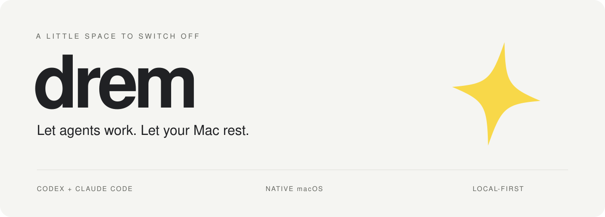
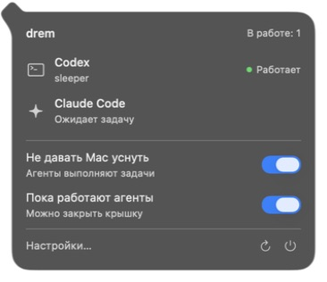

<p align="center">
  <picture>
    <source media="(prefers-color-scheme: dark)" srcset="assets/hero-dark.svg">
    
  </picture>
</p>

<p align="center"><strong>Keep your Mac awake while your coding agents work.</strong></p>
<p align="center"><a href="../README.md">Русский</a> · English</p>

**drem** is a native macOS menu-bar app that tracks active Codex and Claude Code
tasks and holds off sleep until the last task ends. An open agent process alone
does not count as work.

SwiftUI and AppKit. No account, cloud backend, telemetry, or third-party Swift
package dependencies.

The application UI is currently in Russian. Upgrading from Agent Watch imports
sleep, appearance and recovery preferences without deleting the old settings.
The installer replaces old hooks while preserving unrelated handlers.

<p align="center">
  
  <br><sub>The actual drem 1.5.0 popover. Project folder names appear below each agent.</sub>
</p>

## What it does

- Distinguishes working, waiting and offline agents.
- Prevents sleep while at least one agent is working, including with the lid
  closed after a one-time administrator setup.
- Adds an independent Away mode that opens the real macOS login screen on lid
  close while active agents continue behind it.
- Dims only the built-in display when the lid closes during an active agent
  session, then restores its previous brightness on opening.
- Supports manual sessions, timers, battery cutoffs and a global shortcut.
- Shows a monochrome star when the blocker is off, and your chosen icon and
  color when it is on. “drem” uses the same star.

When the last task finishes, drem releases its sleep assertions and lid override.
macOS resumes its normal sleep policy. It does not force sleep, and it cannot
release assertions owned by other applications.

## Build and install

Requires macOS 13+, Git, Python 3 and an Apple developer toolchain with Swift 6+.
Tests require macOS 14+.

```sh
xcode-select --install
git clone https://github.com/mrvasil/drem.git
cd drem
make install
```

For a private repository, authenticate Git first or use
`gh repo clone mrvasil/drem`.

This installs `~/Applications/drem.app` and adds lifecycle hooks to the
Codex and Claude Code configuration, preserving unrelated hooks and creating
backups. Review Codex hooks through `/hooks` if your version requests approval.

```sh
make run     # Build and launch without installing hooks
make check   # Repository checks and isolated installer tests
make test    # Core and Swift Testing suites
make build   # dist/drem.app
```

Builds target the host architecture. Local and CI builds are ad-hoc signed,
not notarized Developer ID releases.

## Set it and leave it

Enable **«Не давать Mac уснуть»** (prevent sleep) and
**«Пока работают агенты»** (while agents work) in the popover.
The latter enables agent-controlled closed-lid operation and may request an
administrator password on first setup.

The agent mode takes priority over manual timers and power/display automation.
Finishing the last task removes the app's blockers while leaving the mode ready
for the next task. Battery protection remains in effect.

Enable **«Вне дома»** before leaving. It does not own a sleep assertion: with no
active task the locked Mac follows normal sleep policy. With an active task the
system stays awake, while the locked display is allowed to turn off. A failed
lock request is reported instead of being presented as protected.

> [!CAUTION]
> Keep an awake, closed laptop on a hard, ventilated surface, never in a bag.
> A force-quit can leave the system-wide lid override enabled until the app
> restarts or you restore it manually. Brightness control uses dynamically
> loaded DisplayServices interfaces and is hardware/OS-dependent.

## How it stays quiet

Lifecycle hooks and filesystem events drive updates. Known logs are read
incrementally. A 15-second watchdog checks known PIDs and appended transcript
bytes; a full reconciliation runs at startup, on recovery/manual refresh and
every five minutes. No full-system one-second polling loop.

Session identity takes precedence over process presence. Detection depends on
agent event formats; this is a local observer, not an official provider status API.

## Documentation

- [Installation and removal](INSTALLATION.md)
- [Modes and priorities](USAGE.md)
- [Architecture](ARCHITECTURE.md)
- [Privacy](PRIVACY.md)
- [Troubleshooting and recovery](TROUBLESHOOTING.md)
- [Contributing](../CONTRIBUTING.md) and [changelog](../CHANGELOG.md)

Detailed guides are currently in Russian. Bug reports and contributions are
welcome in Russian or English.

## License

[GPL-3.0-or-later](../LICENSE). Keep Awake includes code adapted from
[vorssaint-utils](https://github.com/vorssaint/vorssaint-utils);
see [third-party notices](../THIRD_PARTY_NOTICES.md).

Independent project. Not affiliated with Apple, OpenAI or Anthropic.
